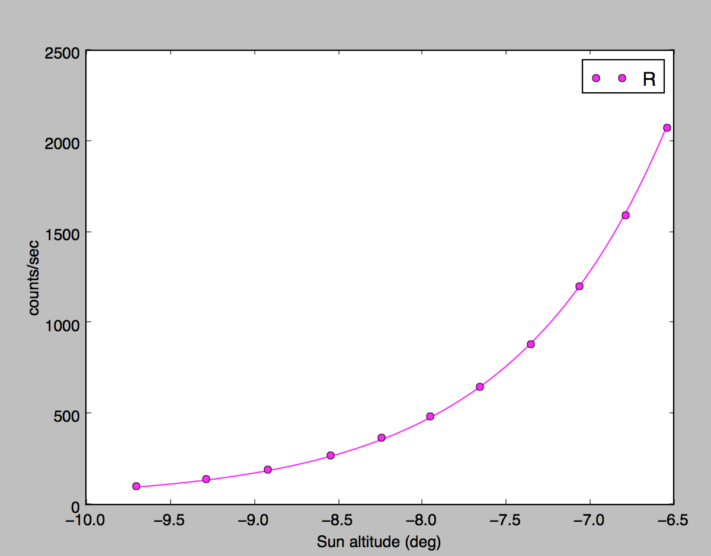

# Chimera Skyflat Plugin

This is a plugin for the [Chimera observatory control system](https://github.com/astroufsc/chimera).

Makes skyflatting easier and less stressful! 😊

## Skyflat Principle

This plugin is based on this preprint article: http://arxiv.org/abs/1407.8283

First one should fit an exponential to the counts/second versus altitude plot.



The exponential coefficients are saved on a JSON file as indicated below and the further skyflats are taken automatically.

## Usage

Install `chimera-skyflat`, then configure it on chimera.config and create a json file with the exponential parameters
on, i.e., `~/.chimera/skyflats.json`.

Running `chimera-skyflat` script:

```
Usage: chimera-skyflat [options]

Chimera - Observatory Automation System - SkyFlats

Options:
  --version             show program's version number and exit
  -h, --help            show this help message and exit
  -v, --verbose         Display information while working
  -q, --quiet           Don't display information while working.
                        [default=True]

  skyFlats:
    --auto              Does a sequence of sky flats
    --skyflat=SKYFLAT   Auto Sky Flats
    --sun-high=DEGREES  Highest Sun altitude
    -n NUMBER, --number=NUMBER
                        Number of skyflats to take on the filter
    -f FILTER, --filter=FILTER
                        Skyflat filter name
    --sun-low=DEGREES   Lowest Sun altitude

  Client Configuration:
    --config=CONFIG     Chimera configuration file to use.
                        default=/Users/william/.chimera/chimera.config
                        [default=/Users/william/.chimera/chimera.config]
    -P PORT, --port=PORT
                        Port to which the local Chimera instance will listen
                        to. [default=9000]

  Object Paths:
    -C PATH, --controllers-dir=PATH
                        Append PATH to controllers load path. This option
                        could be setted multiple times to add multiple
                        directories. [default=['/Users/william/.virtualenvs/ch
                        imera/lib/python2.7/site-
                        packages/chimera/controllers',
                        '/Users/william/.virtualenvs/chimera/lib/python2.7
                        /site-packages/chimera_pverify/controllers',
                        '/Users/william/.virtualenvs/chimera/lib/python2.7
                        /site-packages/chimera_skyflat/controllers']]
```

**Example:**

```bash
$ chimera-skyflat -f R,I -n 3 --auto --sun-hi 0 --sun-lo -12
Pointing scope to the zenith and waiting for the Sun to reach skyflats altitude range
Filter: R, Skyflat # 1 - Exposure time: 2.20 seconds - Counts: 1000.00
Filter: R, Skyflat # 2 - Exposure time: 16.60 seconds - Counts: 1000.00
Filter: R, Skyflat # 3 - Exposure time: 15.20 seconds - Counts: 1000.00
Filter: I, Skyflat # 1 - Exposure time: 0.40 seconds - Counts: 1000.00
Filter: I, Skyflat # 2 - Exposure time: 5.40 seconds - Counts: 1000.00
Filter: I, Skyflat # 3 - Exposure time: 5.60 seconds - Counts: 1000.00
Finished.
```

This takes 3 skyflats on filters `R` and `I` if the sun is between 0 and -12 degrees of altitude.

## Installation

```bash
pip install -U chimera_skyflat
```

Or install from source:

```bash
pip install -U git+https://github.com/astroufsc/chimera-skyflat.git
```

## Configuration Example

Configuration example to be added on `chimera.config` file:

```yaml
controllers:
    - type: AutoSkyFlat
      name: autoskyflat
      site: /Site/0
      telescope: /Telescope/0
      camera: /Camera/0
      filterwheel: /FilterWheel/0
      dome: /Dome/0
      tracking: True             # Enable telescope tracking when exposing?
      flat_position_max: 1       # Skip the slew when the telescope is already this
                                 # close to the flat position; 0 slews every frame. (degrees)
      flat_alt: 75               # Skyflat altitude; the azimuth is always the
                                 # anti-solar one (see below). (degrees)
      pier_side: EAST            # Pier side to take Skyflats on: EAST, WEST or None
      sun_alt_hi: -5             # Highest Sun altitude to make Skyflats. (degrees)
      sun_alt_low: -30           # Lowest Sun altitude to make Skyflats. (degrees)
      exptime_increment: 0.2     # Exposure time increment on integration. (seconds)
      exptime_max: 300           # Maximum exposure time. (seconds)
      exptime_min: 0.2           # Shortest usable exposure, e.g. the camera's own
                                 # minimum. Below it the sky counts as too bright.
      max_wait_iter: 100         # Maximum number of iterations on the dawn wait loop
      ideal_counts: 25000        # Ideal flat CCD counts.
      max_counts: 0              # Discard frames above this level (saturation); 0 disables
      correction_damping: 0.5    # How hard each frame corrects the sky model (see below)
      max_exptime_step: 2.0      # Largest exposure ratio between consecutive frames
      filter_fallback: True      # Step to another filter instead of ending the sequence
      compress_format: NO
      coefficients_file: ~/.chimera/skyflats.json
```

`skyflats.json` file example:

```json
{
    "U": [16500, 70, -14],
    "G": [32002478, 97, 195],
    "R": [355328, 44, 108],
    "I": [41222293, 94, -68],
    "Z": [5985164, 85, 106]
}
```

The coefficients on the list are Scale, Slope and Bias from the equation:

`counts_per_sec = scale * exp(slope * sun_altitude) + bias`

with the sun altitude **in radians**. The paper's own fit has no additive
term (`flux = 10^(0.415 * alt_deg + 5.926)`, i.e. a slope of 54.7 per
radian); keep `bias` at 0 unless you have actually fitted it. A bias that
was guessed rather than measured becomes the whole model once the sky is
faint — it puts a floor under the predicted count rate, which pins the
exposure at `ideal_counts / bias` and stops the controller from ever
concluding that a filter has run out of sky.

## Where the flats are taken

The twilight sky has a brightness gradient, and it is smallest at the
**anti-solar point** — that is the whole subject of the paper above. So that
is where the flats are taken, always: `sun_azimuth + 180`, recomputed before
every frame as the sun moves. There is no azimuth setting, because a fixed
azimuth is the right place only on the day the sun happens to set behind it.

`flat_alt` stays configurable — the horizon, the dome slit and the mount
limits are yours, not the sky's. The paper puts the null point at 75, which
is the default. `flat_position_max` decides how far the telescope may drift
from the null before being re-pointed; 0 re-slews before every frame, which
is closest to the paper's "re-point after 30 s of exposure".

## How the exposure time is chosen

The exposure time comes from integrating that model forward from now until
`ideal_counts`, accounting for the sun's motion during the frame itself.

The coefficients are fitted on some past night; the sky's *shape* holds, its
*normalisation* does not. So every frame corrects the model multiplicatively
by the ratio of measured to expected counts:

- the first frames take the whole ratio, to land on target fast;
- once a frame lands within 25% of `ideal_counts` the model counts as
  calibrated and later corrections are damped by `correction_damping`
  (0.5 = take the square root of the ratio), which rejects clouds and
  satellites instead of chasing them;
- `max_exptime_step` bounds how much the exposure can change between
  consecutive frames, whatever the correction asks for.

An older, additive version of this loop oscillated around the target and
came within a factor of 1.3 of saturating the detector on the 2026-07-22
twilight.

## When a filter runs out of sky

If a filter cannot reach `ideal_counts` within `exptime_max` (dusk) or needs
less than `exptime_min` (dawn), the controller does not end the sequence: it
steps to the next filter in the coefficients file - more sensitive at dusk,
less sensitive at dawn - and keeps going. Set `filter_fallback: False` to
keep the old behaviour.


## Development

### Setup Development Environment

```bash
# Clone the repository
git clone https://github.com/astroufsc/chimera-skyflat.git
cd chimera-skyflat

# Install dependencies
uv sync

# Install pre-commit hooks
uv run pre-commit install --install-hooks
```

### Running Tests

```bash
uv run pytest
```

### Code Quality

This project uses:
- [Ruff](https://docs.astral.sh/ruff/) for linting and formatting
- [pre-commit](https://pre-commit.com/) for automated checks

```bash
# Run linter
uv run ruff check

# Run formatter
uv run ruff format

# Run all pre-commit hooks
uv run pre-commit run --all-files
```

## License

GPL-2.0-or-later

## Contact

For more information, contact us on chimera's discussion list:
https://groups.google.com/forum/#!forum/chimera-discuss

Bug reports and patches are welcome and can be sent over our GitHub page:
https://github.com/astroufsc/chimera-skyflat
